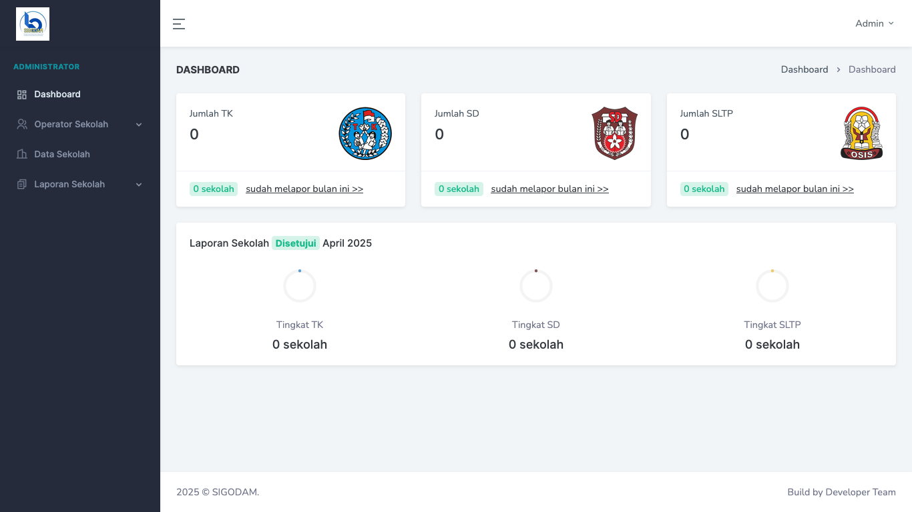
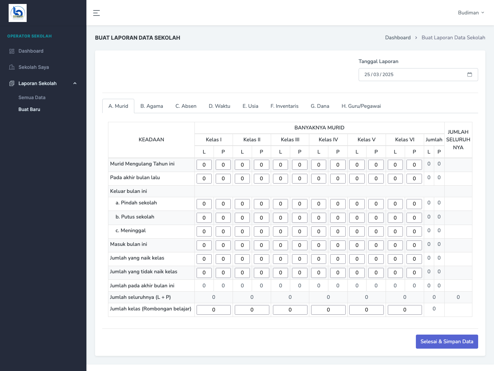

# Sigodam - School Data Reporting Management System

**Sigodam** is a data reporting management application designed to streamline the process of submitting official school reports from TK (Kindergarten), SD (Elementary), and SLTP (Junior High School) institutions. This system enables school operators to submit structured data reports that comply with government regulations, improving accuracy, accountability, and workflow efficiency.

## 🎯 Use Case

The application allows administrators to create login credentials for each school's data operator. Once logged in, operators can fill out and submit reports based on a predefined format aligned with the Ministry of Education's reporting standards.

## 🚀 Key Features

- Admin panel to create and manage school operator accounts
- Operator login and dashboard access
- Report submission forms adapted to official government templates
- Status tracking for submitted reports
- Multi-school support with scoped access
- Printable versions of submitted reports

## 🖼️ Screenshots

### Login Form


### Dashboard


### Add Report


## 🛠️ Tech Stack

- **Framework:** Laravel 11  
- **Frontend:** Livewire, Bootstrap 4  
- **Database:** MySQL

## ⚙️ Installation & Setup

1. Clone this repository:
   ```bash
   git clone https://github.com/aldhi88/sigodam.git
   cd sigodam
   ```

2. Install dependencies:
   ```bash
   composer install
   npm install && npm run dev
   ```

3. Copy the `.env.example` file to `.env`, and configure your database credentials.

4. Run the following commands:
   ```bash
   php artisan key:generate
   php artisan migrate
   ```

5. Start the development server:
   ```bash
   php artisan serve
   ```

## 📄 Notes

Sigodam was built with a focus on real-world usability and alignment with official reporting formats mandated by the Ministry of Education. It ensures secure, traceable, and efficient data flow between schools and authorities.

---
